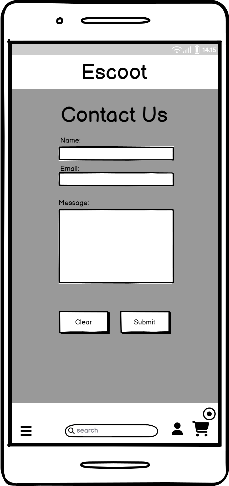
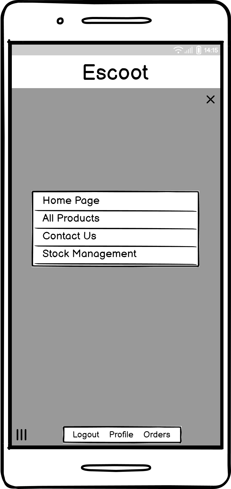
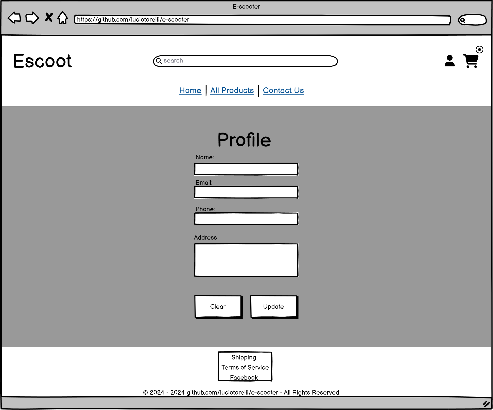

<h2><a href="" target="_blank">Live App here</a></h2>

E-scoot
---

E-scoot is a Django application designed as an ecommerce website.Tailored specifically for the market of electric scooters, it delivers a seamless and personalized shopping experience for users looking to build their ideal e-scooter. It also allows the site owner to efficiently manage their orders.

## Table of Contents

1. [Overview](https://github.com/luciotorelli/escoot#overview)
2. [Epics - User Stories](https://github.com/luciotorelli/escoot#epics-user-stories)

---

# Epics - User Stories

In the initial phase of developing the E-scoot E-commerce Platform, user stories were created to capture the specific needs and expectations of both buyers and the site owner. Following this, the user stories were organized and grouped into coherent themes, resulting in the identification of key epics. This separation into epics streamlined the development process by categorizing related functionalities, ensuring a more organized and efficient approach to building the comprehensive features outlined in the user stories below.

## **Buyer Epics:**

### 1. **Product Purchase and Customization:**
- As a Buyer, I want to purchase an e-scooter by selecting only the parts and upgrades I require for my unique case so that I can customize my purchase to meet my specific needs.
- As a Buyer who already owns an e-scooter, I want to purchase parts separately from the main product so that I can replace or upgrade specific components without buying a new scooter.
- As a first-time site visitor, I want to quickly understand the purpose of the site and what I can accomplish on it so that I can easily navigate and find relevant information.

### 2. **User Account Management:**
- As a Buyer, I want to see my addresses, edit them, or delete them as required so that I can manage my shipping information efficiently.
- As a Buyer, I want to see the status of my order and view past orders so that I can track my purchases and review my order history.
- As a Buyer, I want to sign up for a mailing list to stay up to date on offers so that I can receive updates and promotions.
- As a Buyer, I want to log in and log out of my profile or create a profile when checking out for the first time so that I can access personalized features and track my orders.

### 3. **Shopping Cart and Checkout:**
- As a Buyer, I want to add products to my cart, view the subtotal, edit quantities, or remove products as required so that I can easily manage my shopping experience.
- As a Buyer, I want to pay for my order on a secure checkout page so that I can complete transactions with confidence.

### 4. **Communication and Support:**
- As a Buyer, I want to contact the company either through a chat option or an email form so that I can seek assistance or get answers to my queries.

## **Site Owner Epics:**

### 1. **Website Management:**
- As the Site Owner, I want a modern and simple-to-navigate website to sell my products so that I can provide a positive user experience for potential buyers.
- As the Site Owner, I want to add or remove products so that I can keep my product offerings up to date.
- As the Site Owner, I want to edit the products so that I can make necessary updates or modifications to product information.

### 2. **Order and Customer Management:**
- As the Site Owner, I want to view the orders placed so that I can efficiently process and ship the products to the buyer.
- As the Site Owner, I want to receive emails from buyers when they submit a form or chat on the site so that I can promptly respond to inquiries and provide support.
- As the Site Owner, I want to control the stock of the products and make products unavailable/unlisted so that I can manage inventory effectively.

### 3. **Marketing and Outreach:**
- As the Site Owner, I want to have a Business Facebook page to increase my product/brand reach so that I can leverage social media for marketing and visibility.

### 4. **Security and Data Protection:**
- As the Site Owner, I want to ensure the security and privacy of user information by implementing authentication and data protection measures to safeguard sensitive data so that users can trust the platform.

## **Could have epics:**

- 1. Chat bot to answer queries and check orders statuses
- 2. Reviews on product page

# Wireframes

## All pages:

   
Mobile

      
-  

         
Homepage

            
      

-  

         
Login Page

            
      

-  

         
Change Password

            
      

-  

         
Cart

            
      

-  

         
Checkout

            
      

-  

         
Contact Us

            
      

-  

         
Menu

            
      

-  

         
Orders

            
      

-  

         
Profile

            
      

-  

         
Search

            
      

-  

         
Stock

            
      

   
Desktop

   
-  

         
Homepage

            
      

-  

         
Login

            
      

-  

         
Change Password

            
      

-  

         
Cart

            
      
      

-  

         
Checkout

            
      
  

-  

         
Contact Us

            
      

-  

         
Orders

            
      

-  

         
Popup

            
      

-  

         
Popup

            
      

-  

         
Search

            
      

-  

         
Stock

            
      

## Project Management and Planning

### Agile Methodology

This project was idealized following the Agile methodology where the epics were ordered into sprints based on the importance, timeframe and logic flow. The sprints were them used to create the tasks found within Github built-in project management tool.  

| Sprint | Description                                     |
|--------|-------------------------------------------------|
| Sprint 1 | Project ideation, README, and planning                            |
| Sprint 2 | Admin dashboard and Products                     |
| Sprint 3 | Shopping Experience                     |
| Sprint 4 | Communication and Support                       |
| Sprint 5 | Site Owner Management                            |
| Sprint 6 | Marketing and Security Enhancements              |
| Sprint 7 | Additional Features                              |

### MVC Architecture
This project utilizes the MVC architecture to create a full-stack application. During each sprint those steps were reiterated as required.

## Data Model

## UX

### Wireframes

### Color palette

### Font

## Features

### Future Features
#### Some features were considered for implementation of this project. However, due to the time constrains and importance those were added to future features instead.

---

## Technologies used

---

## Testing

### Test Cases

### Browser Compatibility
#### The app was manually tested on the following browsers. All forms, buttons, views, templates, scripts and functions worked as expected. Database updates are consistent for all browsers.

### Automated Testing

### Issues

Issues were logged using GitHub native issue tracking system. All logged issues can be [viewed here.](https://github.com/luciotorelli/escoot/issues)
They were tagged as either bug, enhancement, documentation or user stories accordingly. 

### Feedback

### CRUD (Create, read, update and delete)
#### During automated and manual tests, the following data manipulation permission through front-end (not including admin) was confirmed working as expected.

### Validation

### Lighthouse

 

### Deployment

---

## Credits

### Special Thanks!

### Resources use

### Imported templates/libraries

---